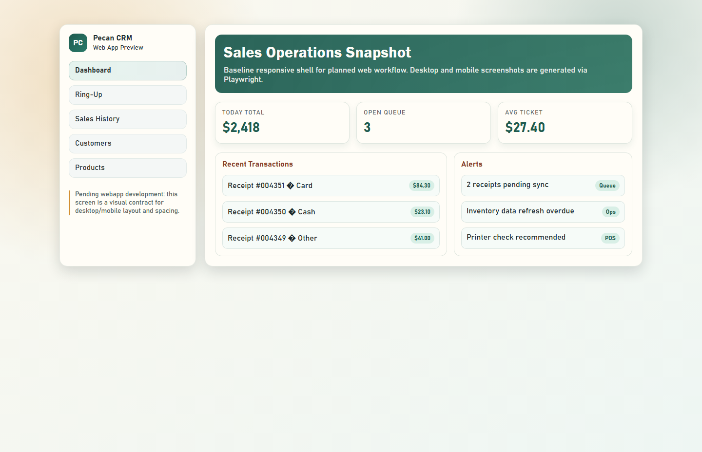
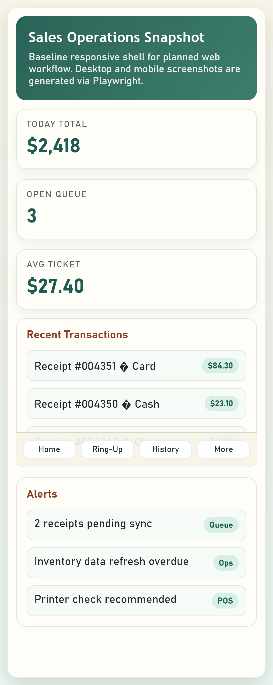

# Pecan Company CRM

Windows desktop CRM/POS for Pecan Company.

## Current focus
- Discovery and architectural decisions
- MVP desktop foundation (PySide6 + Azure SQL)
- Migration planning from legacy Microsoft Access

## Repository layout
- `docs/discovery/`: requirements and decision records
- `docs/schema/`: canonical schema and DB constraints
- `docs/migration/`: Access to Azure SQL mapping and migration strategy
- `docs/security/`: auth and secrets handling
- `docs/operations/`: backup, restore, and release operations
- `docs/screenshots/`: generated desktop/mobile web preview screenshots
- `infra/azure/`: Azure provisioning stubs/templates
- `scripts/azure/`: Azure CLI/SQL helper scripts
- `.env.example`: demo values for local stubbed execution
- `src/pecan_crm/`: application source
- `tests/`: automated tests
- `webapp/`: pending webapp UI preview used for screenshot generation

## MVP decisions (summary)
- Desktop app connects directly to Azure SQL for MVP.
- SQL authentication for MVP with least-privilege app login.
- Payment processing integration is out of scope for MVP.

## Status
The repository is being built milestone-by-milestone from issue tracker definitions.

## Web preview screenshots
Generate desktop and mobile screenshots from the pending `webapp/` preview:

```bash
npm install
npx playwright install chromium
npm run screenshots
```

Outputs:
- `docs/screenshots/web-preview-desktop.png`
- `docs/screenshots/web-preview-mobile.png`

Desktop preview:


Mobile preview:

